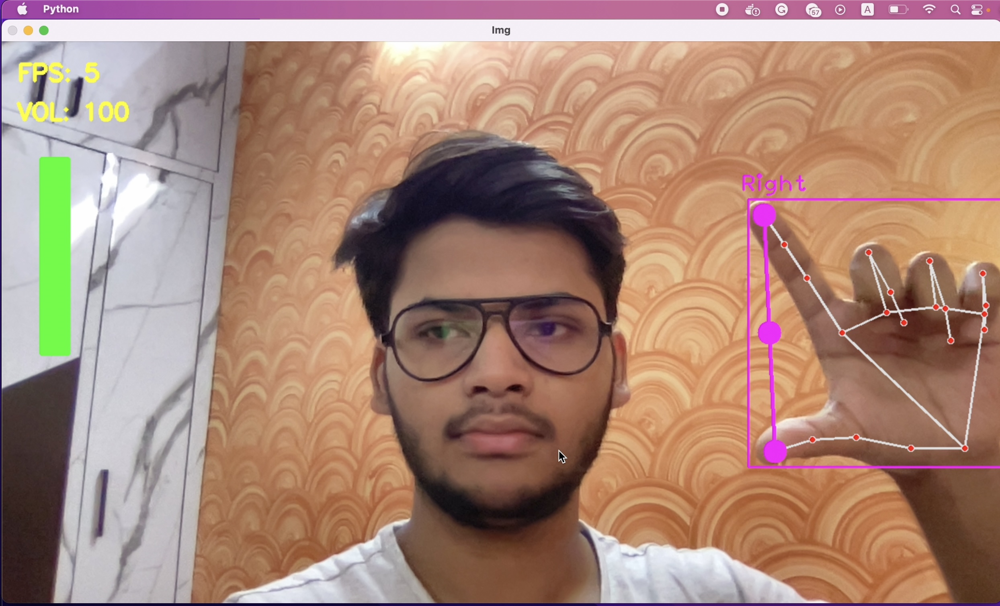

# Volume Controller in OpenCV #
## Preview

 
### Steps to install this locally

Make sure you have Python installed on your system. It only works on MacOS  for windows you will have to use Pycaw and update the source code

- clone the repository into your local system.

    git clone https://github.com/kumarpriyanshu2k2/CV_Volume_Controller.git

- go to the directory in which you have cloned this project.

    cd ./CV_Volume_Controller
- activate the virtual environment by running:

    source myvenv/bin/activate
    
- install the required libraries using the following command:

    pip install -r requirements.txt
    
now you have installed all the required files, you can 
- execute main.py

    python3 main.py

- To exit you will have to kill it from the terminal by pressing
    - ctrl + c

